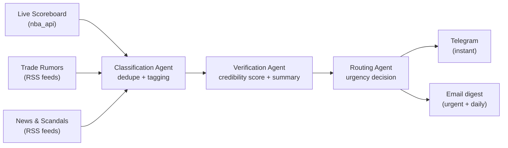

# 🏀 NBA Watch — Multi-Agent Monitoring System


A multi-agent system that continuously monitors official NBA sources — live scores, trade rumors, news and scandals — filters and verifies each piece of information, and notifies you through Telegram (instant) or email (urgent alerts + digest).

Built as a hands-on exploration of **agentic orchestration** (state graphs, conditional routing, persistent state) using [LangGraph](https://github.com/langchain-ai/langgraph), rather than a from-scratch reimplementation of concepts that already have solid tooling. The NBA is the starting domain — the pipeline is designed to extend to other leagues (NCAA, NFL, …) later via [balldontlie.io](https://www.balldontlie.io/), which covers several sports under one unified API.

## Why this project

Two goals drove the design:

1. **Understand multi-agent systems by building one**, not by reading about them — state graphs, agent handoffs, conditional edges, and the failure modes that only show up once real (messy, rate-limited, sometimes blocked) external data is involved.
2. **Ship a clean, professional public repository** — tested code, CI/CD, documented architecture decisions — as a portfolio piece for software/AI engineering roles.

## How it works

The pipeline runs on a schedule via GitHub Actions (short interval for live scores, longer for rumors/news). Each cycle:



1. Watcher agents collect updates from their respective sources.
2. A classification agent deduplicates items and tags them (team, player, category).
3. A verification agent scores rumor reliability by cross-referencing sources and produces a natural-language summary.
4. A routing agent decides urgency and picks the notification channel.

For the MVP, these roles are merged into a single LangGraph agent before being split into specialized nodes.

## Tech stack

| Concern              | Choice                                   |
|-----------------------|-------------------------------------------|
| Language               | Python 3.13                               |
| Agent orchestration    | [LangGraph](https://github.com/langchain-ai/langgraph) (state graph, conditional edges, checkpointing) |
| API layer              | FastAPI (auto-generated Swagger/OpenAPI)  |
| Database                | PostgreSQL via SQLAlchemy (ORM) + Alembic (migrations) |
| Notifications           | python-telegram-bot, Resend (email)       |
| Data source              | [nba_api](https://github.com/swar/nba_api) (live scoreboard), RSS feeds (rumors/news) |
| Dependency management    | [uv](https://github.com/astral-sh/uv)     |
| Code quality              | ruff, black, mypy, pre-commit             |
| Testing                    | pytest (written alongside the code, not after) |
| Containerization             | Docker + docker-compose                |
| CI/CD                          | GitHub Actions (tests on push, scheduled pipeline runs) |

## Project status & roadmap

- [x] **1. Project foundations** — Git conventions, package scaffolding, tooling (ruff/black/mypy/pre-commit)
- [x] **2. `nba_api` exploration** — live scoreboard fetch/parse module, unit-tested against a fixture ([details](docs/nba_api_notes.md))
- [x] **3. Data model** — SQLAlchemy `games` table + Alembic migration, tested against a real Postgres (Docker)
- [x] **4. Detection agent** — LangGraph state graph (fetch → parse → detect → persist → route), notification channel still a stub
- [x] **5. API layer** — FastAPI (`/health`, `/run-cycle`, `/games`) with auto-generated Swagger docs
- [ ] **6. Telegram notifications** — with mocked integration tests
- [ ] **7. Containerization & scheduling** — Docker + GitHub Actions
- [ ] **8. Portfolio polish** — architecture diagram, v1.0 release

This project is under active, incremental development — each step is designed to ship independently, tested, and documented.

## Getting started

Requires [uv](https://github.com/astral-sh/uv), Python 3.13, and Docker (for the local Postgres).

```powershell
git clone https://github.com/stevkouakam/Agent-IA-veille-nba.git
cd Agent-IA-veille-nba
uv sync
.venv\Scripts\Activate.ps1
copy .env.example .env
docker compose up -d db
alembic upgrade head
```

Run the test suite (DB-backed tests need the Postgres container running; they skip themselves otherwise):

```powershell
pytest
```

Run the API locally, with interactive Swagger docs at `http://127.0.0.1:8000/docs`:

```powershell
uvicorn agent_ia_veille_nba.api.app:app --reload
```

Run linting, formatting and type checks:

```powershell
ruff check .
black --check .
mypy src
```

## Project structure

```
src/agent_ia_veille_nba/
├── nba_data/     # External data sources: fetch (I/O) + parse (pure functions)
├── agents/       # LangGraph state graph and agent nodes
├── api/          # FastAPI app, routes, Pydantic schemas
└── db/           # SQLAlchemy models, session, repository
alembic/          # Migration environment and versioned schema changes
tests/            # pytest suite, mirrors the src/ layout
docs/             # design notes and API exploration write-ups
scripts/          # one-off manual exploration/debugging scripts
docker-compose.yml  # local Postgres for development
```

## Notes & learnings

Engineering notes worth reading are kept in [`docs/`](docs/) as they come up — e.g. [`nba_api_notes.md`](docs/nba_api_notes.md) documents the live scoreboard's JSON schema and a CDN-level access restriction found while testing the fetch from a cloud environment, which will need to be accounted for once the pipeline moves to scheduled GitHub Actions runs.

## Author

**Steeve juniX** — [GitHub](https://github.com/stevkouakam)
